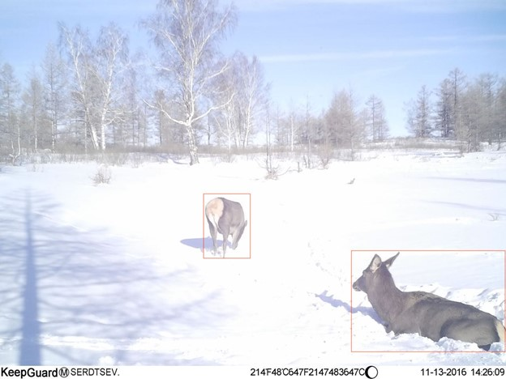

# Классификация снимков с фотоловушек («Цифровой прорыв», 2023) - 5 место
### Кейс от Алтайского государственного университета
https://hacks-ai.ru/hackathons.html?eventId=969077&caseEl=1026328&tab=1

###### Команда: "Деревяшки"

### Описание задачи
В нашей стране большое количество заповедных мест. 
В заповедниках живут разные виды животных, за которыми ученые наблюдают через фотоловушки:  высчитывают популяцию и разные другие важные показатели. 
Проблема заключается в невозможности контролировать качество каждого снимка фотоловушки. 
Т.к. количество снимков с каждой из них насчитывает несколько тысяч в год, просматривать каждую фотографию проблематично.

### Задача участников
Участникам предлагается разработать решение позволяющее классифицировать фотографии на качественные и некачественные, а также определение есть ли на снимке животное. 

### Подход к решению задачи
- Детекция: модель определения наличия животных на снимках (на базе YOLO v8)
- Классификация: Модель определения некачественных снимков (на базе EfficientNet-B4)
- Потоковая обработка изображений выложенных на ЯндексДиск

### Описание файлов решения
- `monitor_YaDisk.py` - мониторинг содержимого Яндекс диска для классификации и перемещения по папкам   
- `union_model.py` - общий модуль обработки фотографий, использует модель детекции и классификации  
- `animal_detection.py` - модель детекции животных на фотографии
- `animal_classification.py` - модель классификации качественные/некачественные снимки
- [`efficient_weights_2class.pth`](https://drive.google.com/file/d/1Bg64U-N3xaErTU4E-DzYvycGwCsX5krh/view?usp=sharing) - [веса модели классификации](https://drive.google.com/file/d/1Bg64U-N3xaErTU4E-DzYvycGwCsX5krh/view?usp=sharing)
- `classification.ipynb` - Ноутбук обучения модели классификации

### Алгоритм обработки файлов на Яндекс диске:
Пользователь располагает фотографии с фотоловушек в папке "Входящие" Яндекс диска.
Модуль `monitor_YaDisk.py` проверяет папку "Входящие", пропускает все изображения через модели классификации и детекции и распределяет фотографии по директориям:
- "Все обработанные файлы"  
- "Животные" - снимки с животными
- "Битые" - некачественные снимки
- "Пустые" - без животных

### Алгоритм работы решения:
1. При запуске `union_model.py` все файлы из заданной директории направляет в модель Детекции, те фотографии. где модель Детекции не обнаружила животных направлятся в модель Классификации 
2. Модель Детекции `animal_detection.py` возвращает два списка: файлы-животные и файлы-пустые
6. Модель Классификации `animal_classification.py` обрабатывает список файлы-пустые и возвращает два списка: файлы-битые и файлы-пустые

### Используемые библиотеки:
- ultralytics
- opencv-python
- pandas
- numpy
- Pytorch
- openCV
- torchmetrics
Файл `requirements.txt` содержит информацию о версиях используемых библиотеках

### Установка
`pip install -r requirements.txt` 
